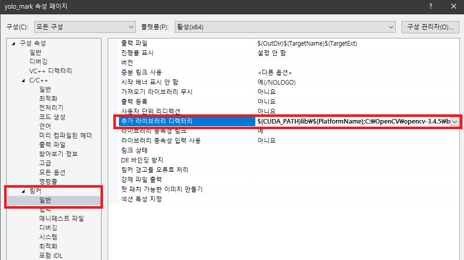

# Yolo_mark
**Windows** & **Linux** Yolo v3, v2 학습용 이미지에 경계상자를 표시하기위한 Windows 및 Linux기반 GUI

## 사용방법
1. [OpenCv](https://github.com/opencv/opencv/releases) 3.4.5버전 설치
  ※ 지원버전: OpenCV 2.x and OpenCV 3.x ※ 
  
  

  * 다운받은 파일을 실행시켜 설치합니다.

2. Yolo_mark 다운로드

  

3. Yolo_mark 폴더에 있는 `yolo_mark.sln`파일 실행합니다.

  

  * 속성 페이지 창 왼쪽 위에 보이는 구성을 모든 구성으로 변경.

  * (프로젝트 오른쪽클릭) -> 속성 -> C/C++ -> 일반 -> 추가 포함 디렉터리: `다운로드경로\opencv\build\include;`

  

  *  링커 -> 일반 -> 추가 라이브러리 디렉터리: `다운로드경로\opencv\build\x64\vc15\lib;`

  

4. Visual Studio에서 Debug모드를 Release모드로 변경후 빌드합니다.

  

* To compile on **Linux** type in console 3 commands:
    ```
    cmake .
    make
    ./linux_mark.sh
    ```


--------

1. To test, simply run 
  * **on Windows:** `x64/Release/yolo_mark.cmd`
  * **on Linux:** `./linux_mark.sh`

2. To use for labeling your custom images:

 * delete all files from directory `x64/Release/data/img`
 * put your `.jpg`-images to this directory `x64/Release/data/img`
 * change numer of classes (objects for detection) in file `x64/Release/data/obj.data`: https://github.com/AlexeyAB/Yolo_mark/blob/master/x64/Release/data/obj.data#L1
 * put names of objects, one for each line in file `x64/Release/data/obj.names`: https://github.com/AlexeyAB/Yolo_mark/blob/master/x64/Release/data/obj.names
 * run file: `x64\Release\yolo_mark.cmd`

3. To training for your custom objects, you should change 2 lines in file `x64/Release/yolo-obj.cfg`:

 * set number of classes (objects): https://github.com/AlexeyAB/Yolo_mark/blob/master/x64/Release/yolo-obj.cfg#L230
 * set `filter`-value 
   * For Yolov2 `(classes + 5)*5`: https://github.com/AlexeyAB/Yolo_mark/blob/master/x64/Release/yolo-obj.cfg#L224
   * For Yolov3 `(classes + 5)*3`

 3.1 Download pre-trained weights for the convolutional layers (76 MB): http://pjreddie.com/media/files/darknet19_448.conv.23 
 
 3.2 Put files: `yolo-obj.cfg`, `data/train.txt`, `data/obj.names`, `data/obj.data`, `darknet19_448.conv.23` and directory `data/img` near with executable `darknet`-file, and start training: `darknet detector train data/obj.data yolo-obj.cfg darknet19_448.conv.23`

For a detailed description, see: https://github.com/AlexeyAB/darknet#how-to-train-to-detect-your-custom-objects

----

#### How to get frames from videofile:

To get frames from videofile (save each N frame, in example N=10), you can use this command:
* on Windows: `yolo_mark.exe data/img cap_video test.mp4 10`
* on Linux: `./yolo_mark x64/Release/data/img cap_video test.mp4 10`

Directory `data/img` should be created before this. Also on Windows, the file `opencv_ffmpeg340_64.dll` from `opencv\build\bin` should be placed near with `yolo_mark.exe`.

As a result, many frames will be collected in the directory `data/img`. Then you can label them manually using such command: 
* on Windows: `yolo_mark.exe data/img data/train.txt data/obj.names`
* on Linux: `./yolo_mark x64/Release/data/img x64/Release/data/train.txt x64/Release/data/obj.names`

----

#### Here are:

* /x64/Release/
  * `yolo_mark.cmd` - example hot to use yolo mark: `yolo_mark.exe data/img data/train.txt data/obj.names`
  * `train_obj.cmd` - example how to train yolo for your custom objects (put this file near with darknet.exe): `darknet.exe detector train data/obj.data yolo-obj.cfg darknet19_448.conv.23`
  * `yolo-obj.cfg` - example of yoloV3-neural-network for 2 object
* /x64/Release/data/
  * `obj.names` - example of list with object names
  * `obj.data` - example with configuration for training Yolo v3
  * `train.txt` - example with list of image filenames for training Yolo v3
  
* /x64/Release/data/img/`air4.txt` - example with coordinates of objects on image `air4.jpg` with aircrafts (class=0)


